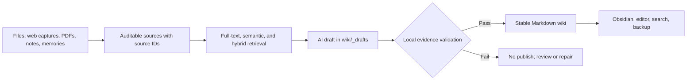

# Local LLM Wiki

**Turn scattered sources, memories, and projects into a personal exobrain that is searchable, reviewable, and grounded in evidence.**

Local LLM Wiki is a local-first, file-first knowledge system. It helps you capture information, retrieve it with full-text and semantic search, turn approved evidence into wiki pages, and keep the durable result in ordinary files you control.

AI can organize, summarize, reason, and draft. It cannot silently promote its own output into fact.

Read the [Chinese README](README.zh-CN.md) · [Quick start](docs/product/quickstart-zh.md) · [Command guide](docs/product/command-guide.md) · [Roadmap](docs/product/roadmap.md)

`Local-first` · `Evidence-gated` · `Plain-file knowledge` · `Python 3.11+ on Windows` · `Alpha`

## From Information to an Exobrain



This is not a chat history folder and not a vector database wrapped in a prompt. The long-lived asset is a source-backed knowledge graph in Markdown; databases, embeddings, caches, and reports remain rebuildable local state.

## Why It Stands Out

| Capability | Typical note app | Typical RAG prototype | Local LLM Wiki |
|---|---|---|---|
| Durable knowledge | App-managed notes | Database or chunks | Plain files plus source cards |
| AI-generated facts | Not applicable | May be returned directly | Must pass evidence and publish gates |
| Evidence depth | Links or attachments | Document-level citation | Claim-level exact quotes from local chunks |
| Memory capture | Manual notes | Bound to one conversation | Candidate → review → auditable source |
| Retrieval | Mostly keyword search | Mostly vector search | SQLite FTS + semantic + hybrid search |
| Failed retrieval | Empty result | Model may still answer | Empty context means no draft and no write |
| Publishing | Direct editing | Direct model output | Draft → validate → publish with rollback controls |
| Portability | Depends on export | Depends on the stack | Files are primary; indexes are rebuildable |

### Your knowledge stays inspectable

Sources live in `raw/` and `sources/`; stable pages live in `wiki/`; reviews and governance records live in `meta/`. SQLite databases and vector indexes accelerate the system but do not become the only copy of your knowledge.

### AI drafts, local evidence decides

AI/LLM output is never a fact source; stable claims require local evidence. A publishable factual claim must be represented in the draft manifest, tied to a source chunk that was actually retrieved, and supported by an exact quote from that chunk.

### Important memories do not become facts by accident

`capture-candidate`, `review-candidate`, and `publish-memory` separate “this may matter later” from “this is confirmed long-term memory.” Candidate memories stay outside stable knowledge until they are reviewed and converted into an auditable source.

### Search is more than one index

Use local SQLite full-text search, a configured local embedding endpoint such as `bge-m3`, or hybrid retrieval that combines both. Answers can include source IDs and evidence quotes so you can inspect the basis instead of trusting a fluent response.

### The vault can move without losing its identity

Allowlisted backup, restore-to-new-root, and migration verification protect durable files while excluding rebuildable databases, model caches, temporary OCR files, secrets, and other runtime state.

### Operational safety is part of the product

Path traversal checks, write locks, secret redaction, source review, schema validation, governance reports, provider preflight, draft rollback, and explicit roots are enforced by local code rather than left as prompt instructions.

## What You Can Do

### Capture and import

- Capture a possible long-term memory without declaring it stable.
- Import local files, an inbox, SingleFile web captures, Zotero exports, PDFs, or OCR-derived text.
- Create auditable self-statements for facts the user has explicitly confirmed.

### Retrieve and understand

- Search with full-text, semantic, or hybrid retrieval.
- Ask questions against local evidence and receive source IDs and quotes.
- Measure retrieval quality with explicit benchmark cases instead of relying on intuition.

### Distill and maintain

- Generate topic suggestions and evidence-constrained wiki drafts.
- Validate every content-bearing factual statement before publication.
- Run daily workflow planning, exobrain status checks, linting, governance, and trust reports.

### Operate and migrate

- Inspect configuration and repository health without calling a provider.
- Use a local read-only web console for status and copyable commands.
- Back up durable assets, restore into a new root, and verify migration integrity.

## Try It with Synthetic Data

The public demo uses synthetic demo data only. Real user vault data is not uploaded. No cloud or LLM provider is configured or called by default.

```powershell
git clone "https://github.com/WuKing777/local-llm-wiki.git" "local-llm-wiki"
cd "local-llm-wiki"
python -B -m pip install -e .
python -B -m kb --help
kb --help
python -B -m kb doctor --root "examples/demo-root"
python -B -m kb product-console --root "examples/demo-root" --json
python -B -m kb web-console --root "examples/demo-root" --port 0 --no-open
```

Run the expanded first-run story with `tools/run-demo.ps1`:

```powershell
.\tools\run-demo.ps1
```

Do not point demo commands at a real user vault. `examples/demo-root` and the demo story exist to show behavior without exposing private sources, real provider responses, or user profiles.


Start with [中文快速开始](docs/product/quickstart-zh.md), then follow the synthetic [首次运行演示](docs/product/first-run-demo.md). The [本地网页控制台](docs/product/local-web-console.md) provides a read-only browser view, while the [命令选择指南](docs/product/command-guide.md) maps common goals to commands.

## Create Your Own Local Root

Initialize a directory you control and always pass it explicitly:

```powershell
python -B -m kb init --root "<root>"
python -B -m kb doctor --root "<root>"
python -B -m kb schema-check --root "<root>" --json
python -B -m kb product-console --root "<root>" --json
python -B -m kb web-console --root "<root>" --no-open
```

After initialization, the Markdown vault can be opened in Obsidian or another editor. Obsidian is optional; this release does not claim a certified Obsidian plugin integration.

## Core Workflows

Import and retrieve evidence:

```powershell
python -B -m kb ingest "<source-file>" --root "<root>"
python -B -m kb ingest-inbox --root "<root>"
python -B -m kb rebuild-index --root "<root>"
python -B -m kb search "<query>" --root "<root>"
python -B -m kb answer "<question>" --root "<root>"
```

Capture a candidate memory before turning it into a stable source:

```powershell
python -B -m kb capture-candidate --root "<root>" --type self_statement --text "<candidate text>" --event-date "<date>" --privacy personal --confidence confirmed --value-reason "<reason>" --suggested-source-type self_statement
python -B -m kb review-candidate "<candidate-id>" --root "<root>" --status approved
python -B -m kb publish-memory "<candidate-id>" --root "<root>" --confirm
```

Use the LLM path only after evidence exists and provider use has been explicitly approved:

```powershell
python -B -m kb llm-preflight --root "<root>" --json
python -B -m kb llm-draft --root "<root>" --query "<query>" --title "<title>"
python -B -m kb validate-draft --root "<root>" "<draft-path>" --target "<title>"
python -B -m kb publish-draft --root "<root>" "<draft-path>" --target "<title>"
```

Review and govern stable knowledge:

```powershell
python -B -m kb review-source "src-xxxxxxxxxxxx" --root "<root>" --status reviewed --reviewer "<reviewer>"
python -B -m kb lint --root "<root>"
python -B -m kb status --root "<root>"
python -B -m kb govern --root "<root>"
python -B -m kb trust-report --root "<root>" --json
```

## Trust Boundary

The evidence gate proves traceability, not universal truth. It can prove that a published claim is supported by exact text in an approved local source that entered the draft context. It cannot prove that the source itself is correct.

- DeepSeek and other configured LLMs may organize, summarize, reason, and draft; they are not evidence.
- Local embeddings are retrieval accelerators, not reasoning authority or citation authority.
- No provider is called unless the user explicitly configures and invokes a provider workflow.
- Empty evidence retrieval must fail without generating a draft.
- Stable wiki content must pass `validate-draft` and `publish-draft`.
- Secrets, full provider responses, private source text, and private paths must not enter public reports or Git history.

See [Privacy and Secrets](docs/product/privacy-and-secrets.md) and [Provider Preflight](docs/product/provider-preflight.md) before configuring a provider.

## Current Status

Local LLM Wiki is an alpha-stage Windows/Python project. The repository provides the local engine, synthetic demo, CLI workflows, read-only web console, evidence gates, tests, and operational documentation. It does not currently provide a hosted service, installer, PyPI package, GitHub release, or certified real-provider and real-vault product readiness.

The public repository must be produced as a clean snapshot that excludes private Git history and private runtime data.

## Documentation

- [CONTRIBUTING.md](CONTRIBUTING.md)
- [Roadmap](docs/product/roadmap.md)
- [Release Checklist](docs/product/release-checklist.md)
- [Installation](docs/product/installation.md)
- [Configuration](docs/product/configuration.md)
- [Backup, Restore, and Migration](docs/product/backup-restore-migration.md)
- [Privacy and Secrets](docs/product/privacy-and-secrets.md)
- [Provider Preflight](docs/product/provider-preflight.md)
- [Open Source Release](docs/product/open-source-release.md)
- [Examples](examples/README.md)
- [LICENSE](LICENSE)
- [SECURITY.md](SECURITY.md)

## Verification

```powershell
python -B -m unittest tests.test_open_source_distribution tests.test_open_source_release tests.test_docs_encoding -v
python -B -m unittest tests.test_public_export -v
python -B -m unittest discover -s tests -v
```
