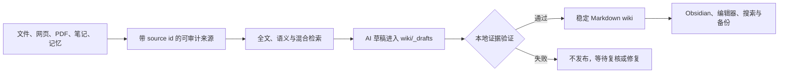

# Local LLM Wiki

**把散落的资料、记忆与项目，变成一个有证据、会检索、能复盘的个人外脑。**

Local LLM Wiki 是一套本地优先、文件优先的个人知识系统。它帮助你收集信息，使用全文与语义检索找到信息，把经过确认的证据沉淀成 wiki，并把长期知识保存在你能直接查看和迁移的普通文件中。

AI 可以整理、总结、推理和起草，但不能把自己的输出悄悄变成事实。

English entry: [English README](README.md) · [中文快速开始](docs/product/quickstart-zh.md) · [命令选择指南](docs/product/command-guide.md) · [Roadmap](docs/product/roadmap.md)

`本地优先` · `证据门禁` · `普通文件是真源` · `Windows / Python 3.11+` · `Alpha`

## 从信息到外脑



它不是聊天记录文件夹，也不是给向量数据库套一层提示词。长期资产是由来源支撑的 Markdown 知识网络；数据库、embedding、缓存和报告都只是可以重建的本地状态。

## 它为什么不一样

| 能力 | 常见笔记软件 | 常见 RAG 原型 | Local LLM Wiki |
|---|---|---|---|
| 长期知识 | 由 App 管理的笔记 | 数据库或 chunks | 普通文件与 source cards |
| AI 生成事实 | 不适用 | 可能直接返回 | 必须通过证据与发布门禁 |
| 证据粒度 | 链接或附件 | 文档级引用 | 本地 chunk 的 claim 级精确原文 |
| 记忆进入方式 | 手工记笔记 | 依赖单次聊天 | 候选 → 确认 → 可审计 source |
| 检索方式 | 以关键词为主 | 以向量为主 | SQLite FTS + 语义 + 混合检索 |
| 没搜到证据 | 返回空结果 | 模型仍可能回答 | 空 context 不生成、不写入 |
| 知识发布 | 直接编辑 | 模型直接生成 | 草稿 → 验证 → 发布，并带回滚控制 |
| 迁移能力 | 依赖导出 | 依赖技术栈 | 文件是真源，索引可重建 |

### 你的知识始终可以直接检查

来源原文和 source cards 分别保存在 `raw/` 与 `sources/`，稳定页面保存在 `wiki/`，复核和治理记录保存在 `meta/`。SQLite 与向量索引可以增强能力，但不会成为知识的唯一副本。

### AI 负责起草，本地证据负责裁决

LLM 输出永远不是事实来源。稳定知识必须有本地证据。任何准备发布的事实性 claim，都必须记录在草稿清单中，引用本次真实检索到的 source chunk，并由该 chunk 中的精确原文支持。

### 重要记忆不会在你不知情时变成事实

`capture-candidate`、`review-candidate` 和 `publish-memory` 把“以后可能有用”与“已确认的长期记忆”分开。候选记忆只有经过复核并转换成可审计 source 后，才能进入稳定知识。

### 检索不依赖单一索引

你可以使用本地 SQLite 全文检索、配置本地 `bge-m3` 等 embedding endpoint，或同时结合两者的混合检索。回答可以携带 source id 与证据原文，让你检查依据，而不是只能相信流畅的模型回答。

### 换电脑或换工具，不会失去知识主体

系统提供允许列表备份、恢复到新目录和迁移一致性校验。稳定文件会被保护；可重建数据库、模型缓存、临时 OCR 文件、secret 和运行状态不会被误当作核心知识。

### 安全不是一句提示词

路径穿越检查、写锁、secret 脱敏、source review、schema 校验、治理报告、provider preflight、草稿回滚和显式 root，都由本地确定性代码执行。

## 它能帮你做什么

### 收集与导入

- 先捕获可能有长期价值的记忆，而不是直接宣布它是事实。
- 导入本地文件、inbox、SingleFile 网页、Zotero 导出、PDF 或 OCR 派生文本。
- 把用户明确确认的本人陈述做成可审计来源。

### 检索与理解

- 使用全文、语义或混合检索查找本地知识。
- 基于本地证据回答问题，并返回 source id 与证据原文。
- 用明确的 benchmark 评估检索质量，而不是凭感觉判断系统是否聪明。

### 沉淀与维护

- 根据来源生成主题建议和受证据约束的 wiki 草稿。
- 发布前验证每一条有内容的事实陈述。
- 运行每日工作流、外脑状态检查、lint、governance 和 trust report。

### 运行与迁移

- 在不调用模型的情况下检查配置、schema 与知识库健康状态。
- 使用本地只读网页控制台查看状态和可复制命令。
- 备份稳定资产，恢复到新目录，并验证迁移完整性。

## 用合成数据快速体验

公开演示仅使用 synthetic demo 数据。默认不会配置或调用云端/LLM provider。

```powershell
git clone "https://github.com/WuKing777/local-llm-wiki.git" "local-llm-wiki"
cd "local-llm-wiki"
python -B -m pip install -e .
python -B -m kb --help
kb --help
python -B -m kb doctor --root "examples/demo-root"
python -B -m kb product-console --root "examples/demo-root" --json
python -B -m kb web-console --root "examples/demo-root" --port 0 --no-open
```

运行完整的首次体验故事：

```powershell
.\tools\run-demo.ps1
```

不要把演示命令指向真实用户库。`examples/demo-root` 与演示故事只用于展示行为，不包含私有来源、真实 provider response 或真实用户档案。


建议先阅读 [中文快速开始](docs/product/quickstart-zh.md)，再运行 [首次运行演示](docs/product/first-run-demo.md)。[本地网页控制台](docs/product/local-web-console.md) 提供只读浏览器视图，[命令选择指南](docs/product/command-guide.md) 可以把日常目标映射到具体命令。

## 创建自己的本地外脑

初始化一个由你控制的目录，并始终显式传入 root：

```powershell
python -B -m kb init --root "<root>"
python -B -m kb doctor --root "<root>"
python -B -m kb schema-check --root "<root>" --json
python -B -m kb product-console --root "<root>" --json
python -B -m kb web-console --root "<root>" --no-open
```

初始化后，可以在 Obsidian 或其他编辑器中打开这个 Markdown vault。Obsidian 是可选前端；当前版本不声称已经提供经过认证的 Obsidian 插件集成。

## 核心工作流

导入和检索证据：

```powershell
python -B -m kb ingest "<source-file>" --root "<root>"
python -B -m kb ingest-inbox --root "<root>"
python -B -m kb rebuild-index --root "<root>"
python -B -m kb search "<query>" --root "<root>"
python -B -m kb answer "<question>" --root "<root>"
```

把内容作为候选记忆捕获，而不是直接变成稳定 source：

```powershell
python -B -m kb capture-candidate --root "<root>" --type self_statement --text "<candidate text>" --event-date "<date>" --privacy personal --confidence confirmed --value-reason "<reason>" --suggested-source-type self_statement
python -B -m kb review-candidate "<candidate-id>" --root "<root>" --status approved
python -B -m kb publish-memory "<candidate-id>" --root "<root>" --confirm
```

只有在本地证据存在、并且用户明确批准 provider 使用后，才进入 LLM 流程：

```powershell
python -B -m kb llm-preflight --root "<root>" --json
python -B -m kb llm-draft --root "<root>" --query "<query>" --title "<title>"
python -B -m kb validate-draft --root "<root>" "<draft-path>" --target "<title>"
python -B -m kb publish-draft --root "<root>" "<draft-path>" --target "<title>"
```

复核和治理稳定知识：

```powershell
python -B -m kb review-source "src-xxxxxxxxxxxx" --root "<root>" --status reviewed --reviewer "<reviewer>"
python -B -m kb lint --root "<root>"
python -B -m kb status --root "<root>"
python -B -m kb govern --root "<root>"
python -B -m kb trust-report --root "<root>" --json
```

## 可信边界

证据门禁证明的是“可追溯”，不是全知全能。它可以证明某条发布后的 claim 得到了本次上下文中某份已批准本地来源的精确原文支持，但不能证明来源本身必然正确。

- DeepSeek 和其他已配置 LLM 可以整理、总结、推理和起草，但不能作为证据。
- 本地 embedding 只是检索加速层，不是推理权威或引用权威。
- 用户没有明确配置并调用 provider 流程时，系统不会调用 provider。
- 没有检索到证据时必须失败，不得生成草稿。
- 稳定 wiki 必须通过 `validate-draft` 与 `publish-draft`。
- secret、完整 provider response、私有来源正文和具体私有路径不得进入公开报告或 Git history。

配置 provider 前请先阅读 [Privacy and Secrets](docs/product/privacy-and-secrets.md) 与 [Provider Preflight](docs/product/provider-preflight.md)。

## 当前状态

Local LLM Wiki 目前是处于 alpha 阶段的 Windows/Python 项目。仓库包含本地引擎、合成演示、CLI 工作流、只读网页控制台、证据门禁、测试和运行文档；当前不提供托管服务、安装器、PyPI package、GitHub release，也不声称已经完成真实 provider 与真实用户库的产品级认证。

公开仓库必须来自隔离 private Git history 与私有运行数据的 clean snapshot。

## 文档

- [CONTRIBUTING.md](CONTRIBUTING.md)
- [Roadmap](docs/product/roadmap.md)
- [Release Checklist](docs/product/release-checklist.md)
- [Installation](docs/product/installation.md)
- [Configuration](docs/product/configuration.md)
- [Backup, Restore, and Migration](docs/product/backup-restore-migration.md)
- [Privacy and Secrets](docs/product/privacy-and-secrets.md)
- [Provider Preflight](docs/product/provider-preflight.md)
- [Open Source Release](docs/product/open-source-release.md)
- [Examples](examples/README.md)
- [LICENSE](LICENSE)
- [SECURITY.md](SECURITY.md)

## 验证

```powershell
python -B -m unittest tests.test_open_source_distribution tests.test_open_source_release tests.test_docs_encoding -v
python -B -m unittest tests.test_public_export -v
python -B -m unittest discover -s tests -v
```
