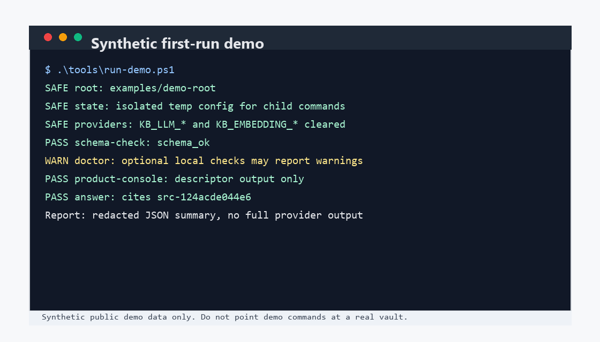
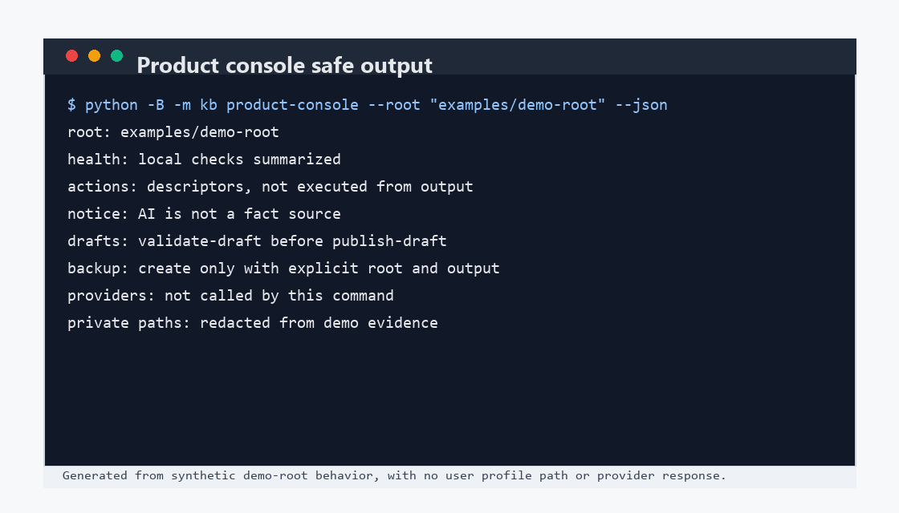

# 首次运行演示

这个演示默认使用 `examples/demo-story` 中的公开合成资料，在临时 temp synthetic root 中跑完整故事链。它不写入 tracked fixture，不代表真实提供商可用，也不批准真实库操作。

## 一条命令

从仓库根目录运行 `tools/run-demo.ps1`：

```powershell
.\tools\run-demo.ps1
```

脚本默认会创建临时合成根目录。它会为子进程隔离配置目录，清空常见 provider 环境变量，并写出一个 `synthetic-demo-story-v1` JSON 报告。报告不会保存完整 provider 输出、真实用户路径、真实 vault 内容或 API key。

如果你显式传入其他根目录，必须同时传入 `-AllowCustomRoot`：

```powershell
.\tools\run-demo.ps1 -DemoRoot "<root>" -AllowCustomRoot
```

不要把这个开关用于未审阅的真实库。真实库操作需要单独的明确范围和路径。

## 演示材料

`examples/demo-story` 包含至少三份公开合成 source material。每份资料都标明 `Synthetic public demo material`、`privacy: public`、`No real user data` 和 `safe for public release`。脚本把这些 fixture 导入临时根目录后才生成 source card 和稳定 wiki 页面。



## 脚本会运行什么

脚本运行本地命令，并只把脱敏摘要写入报告：

```powershell
python -B -m kb init --root "<temp-synthetic-root>"
python -B -m kb ingest "<source-file>" --root "<temp-synthetic-root>"
python -B -m kb review-source "<source-id>" --root "<temp-synthetic-root>" --status reviewed
python -B -m kb capture-candidate --root "<temp-synthetic-root>" --type preference --text "<candidate text>" --event-date "2026-07-09" --privacy public --confidence confirmed --value-reason "<why useful>" --suggested-source-type self_statement
python -B -m kb review-candidate "<candidate-id>" --root "<temp-synthetic-root>" --status approved
python -B -m kb publish-memory "<candidate-id>" --root "<temp-synthetic-root>" --confirm
python -B -m kb validate-draft --root "<temp-synthetic-root>" "wiki/_drafts/synthetic-demo-story.md" --target "Synthetic Demo Story"
python -B -m kb publish-draft --root "<temp-synthetic-root>" "wiki/_drafts/synthetic-demo-story.md" --target "Synthetic Demo Story"
python -B -m kb trust-report --root "<temp-synthetic-root>" --json
python -B -m kb govern --root "<temp-synthetic-root>"
python -B -m kb backup --root "<temp-synthetic-root>" --output "<backup.zip>"
python -B -m kb restore --backup "<backup.zip>" --root "<restored-root>"
python -B -m kb migrate-check --source "<temp-synthetic-root>" --restored "<restored-root>" --json
```

如果你只想检查根目录健康状态，而不是运行完整故事链，可以单独运行：

```powershell
python -B -m kb doctor --root "<root>"
python -B -m kb schema-check --root "<root>"
```

示例视觉证据是 `docs/product/assets/product-console-demo.png`：



`search` 和 `answer` 只读取合成演示材料。source ids are generated during temp-root import, so use the report's `ingested_sources` list and safe step summaries to see which `src-...` ids were used in that run.

## 不要误读演示

- 演示不做在线 provider 探测。
- 演示不使用真实 LLM、真实 embedding provider 或真实用户 vault。
- 演示不证明真实 provider、真实发布、真实检索 benchmark 或真实 Obsidian 工作流已经准备好。
- 演示不改变 `product-console` 行为，也不新增本地 web console、Obsidian plugin、检索算法或 trust report 功能。

需要选择后续命令时，回到 [命令选择指南](command-guide.md)。

## Expanded synthetic demo story

`tools/run-demo.ps1` now builds the full default demo from `examples/demo-story`, not by writing into tracked fixtures. The script initializes a temp synthetic root, imports at least three public synthetic source files, records `review-source` for each ingested source id, runs local search and answer, runs `capture-candidate`, `review-candidate`, and `publish-memory`, writes a deterministic draft under `wiki/_drafts`, runs `validate-draft` and `publish-draft`, then runs `trust-report`, `govern`, `backup`, `restore`, and `migrate-check`.

The report schema is `synthetic-demo-story-v1`. Its boundaries are `offline=true`, `synthetic_data=true`, `writes_real_user_state=false`, `provider_environment_cleared=true`, and `tracked_fixtures_mutated=false`. The report uses `<temp-synthetic-root>` instead of temp absolute paths and records only safe step summaries.

`examples/demo-root` remains a small tracked fixture for read-only smoke examples. The expanded default story writes only to the temp synthetic root and disposable backup/restore paths.
